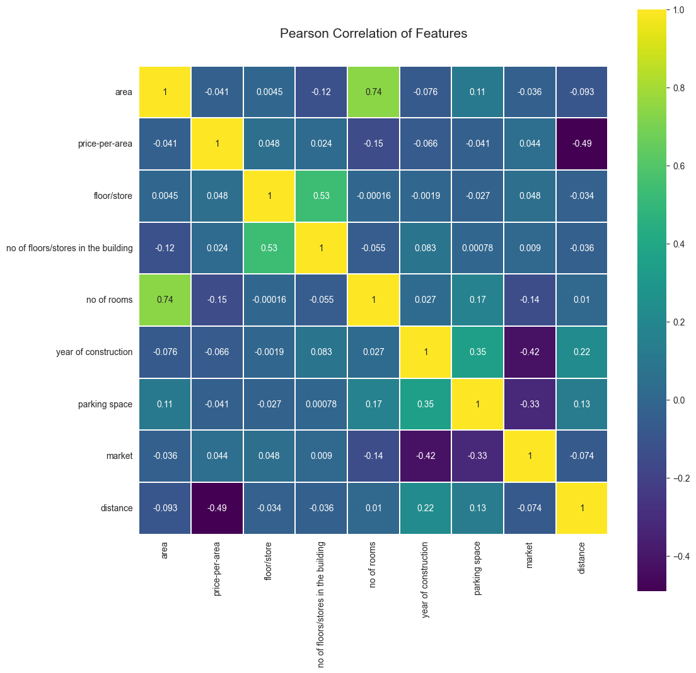
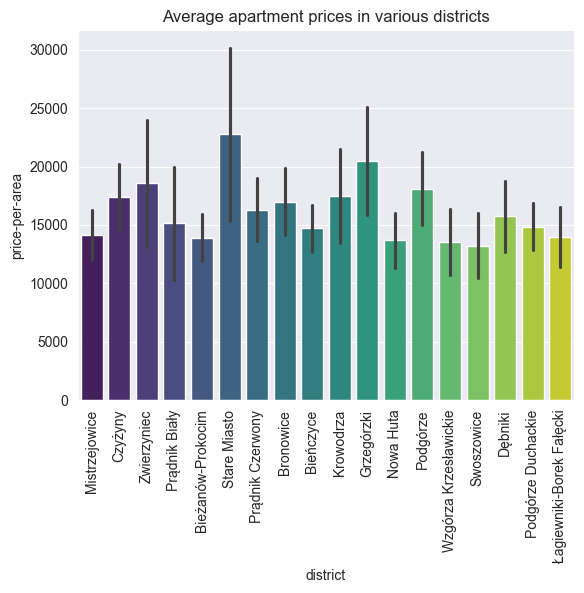
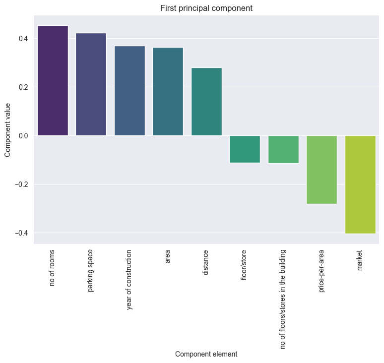
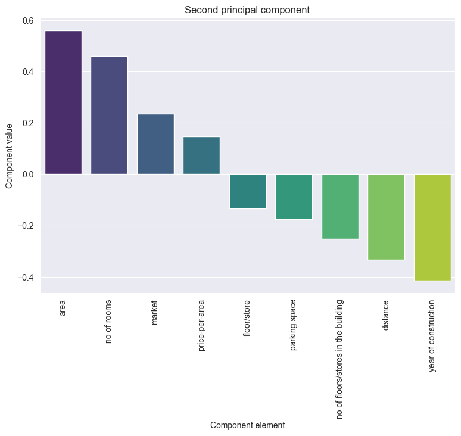
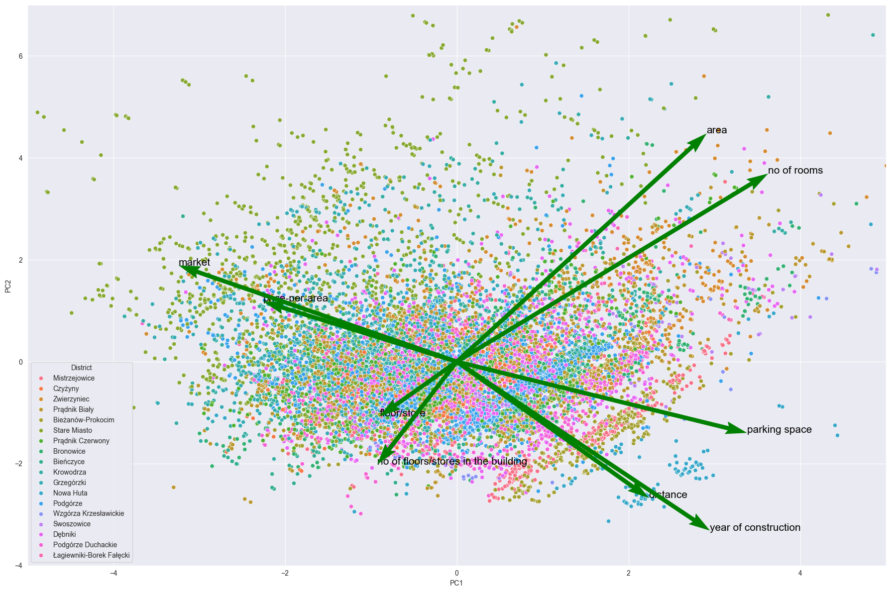

# Analysis of Real Estate Prices in Kraków  

A project conducted as part of the **Data Exploration** course during the summer semester of the 2023/2024 academic year at the Faculty of Computer Science, AGH University of Science and Technology in Kraków, under the supervision of Dr. Tomasz Pełecha-Pilichowski.  

## Authors  
- Katarzyna Dębowska  
- Kacper Sobczyk  
- Piotr Urbańczyk  

## Abstract  
The project aims to understand the relationship between apartment characteristics and their listing prices in the local real estate market. We will conduct descriptive statistics, hedonic regression, and spatial analysis to identify the key factors influencing apartment prices in Kraków.  

### Data  
- **Dataset**: A dataset containing information on real estate sale listings was used.  
- **Data source**: The data was extracted using automated methods from two popular real estate listing platforms.  
- **Data preparation**:  
  - Understanding the data  
  - Handling missing values  
  - Standardization  
  - Format conversion  
  - Supplementing geographic data (coordinates) based on addresses  
  - Adding a distance vector from the city center (Main Market Square) based on geographic data  

### Analyses  
- Descriptive statistics  
- Hedonic regression  
- Correlation matrix (identifying factors influencing real estate prices)  
- Spatial analysis  

### Modeling  
- Comparison of different models for predicting real estate prices based on selected features.  

### (Expected) Results  
- Understanding which real estate features have the most significant impact on listing prices in Kraków.  
- Identifying potential price trends in different districts.  


### Table of Contents  
1. [Understanding the Data](#understanding-the-data)  

   1.1. [Data Collection](#data-collection)  

   1.2. [Data Description](#data-description)  

   1.3. [Initial Data Quality Assessment](#initial-data-quality-assessment)  

2. [Data Preparation](#data-preparation)  

   2.1. [Column Operations](#column-operations)  

   2.2. [Examples of Expert Knowledge Application](#examples-of-expert-knowledge-application)  

   2.3. [Data Quality Verification](#data-quality-verification)  

   2.4. [Data Engineering](#data-engineering)  

   2.5. [Data Exploration](#data-exploration)  

3. [Data Analysis](#data-analysis)  

   3.1. [Correlation Matrix (Pearson Matrix)](#correlation-matrix-pearson-matrix)  

   3.2. [Analysis of Apartment Prices in Different Districts](#analysis-of-apartment-prices-in-different-districts)  

   3.3. [Principal Component Analysis (PCA)](#principal-component-analysis-pca)  

   3.4. [Feature Selection](#feature-selection)  

4. [Modeling](#modeling)  

   4.1. [Model Evaluation](#model-evaluation)  

   4.2. [Prediction Results](#prediction-results)  

5. [Data Visualization in the Spatial Component](#data-visualization-in-the-spatial-component)  


   
## Understanding the Data  
The project utilizes a dataset containing information on apartment sale listings in Kraków.  

### Data Collection  

#### Data Source  
The data was obtained using automated methods from publicly accessible sources—two popular real estate listing platforms: [nieruchomości-online.pl](nieruchomości-online.pl) and [otodom.pl](otodom.pl).  

#### Data Acquisition Methods  
Both datasets were collected using a professional, dedicated web scraping solution written in `Scala`, which, in the case of dynamic crawling, utilizes the `Selenium` platform.  

Example fragment of a configuration file:  
```json
"extractionTemplate": {
    ".box-offer-top h1.h1Title": {
        "resultId": "name/title",
        "optional": true
    },
    ".adress span": {
        "resultId": "address",
        "optional": true
    },
    ...
    "#detailsWrapper > div:first-of-type ul:nth-of-type(1) li:nth-of-type(5) span": {
        "resultId": "form of ownership",
        "optional": true
    }
}
```
Example fragment of crawl results in `json` format::
```json
"url": "https://krakow.nieruchomosci-online.pl/mieszkanie,na-sprzedaz/24679599.html",
"results": [
	{
		"area": "41 m²",
		"market": "wtórny",
		"price": "750 000 zł",
		"name/title": "Mieszkanie, ul. Wawrzyńca",
		"no of floors/stores in the building": "4",
		"parking space": "-",
		"no of rooms": "2",
		"address": "Wawrzyńca, Kazimierz, Kraków, małopolskie",
		"price-per-area": "18 292,68 zł/m²",
		"floor/store": "2",
		"year of construction": "1930"
	}
],
```
The data was then converted into `csv` format using a simple `Python` script.

### Data Description  

The data was collected five times between 08.03.2024 and 05.05.2024 at two-week intervals for both data sources (`nieruchomości-online.pl`, `otodom.pl`) separately.  

##### nieruchomosci-online Dataset  
The files obtained from `nieruchomości-online.pl` contain 13 columns:  
`'url', 'name/title', 'address', 'price', 'area', 'price-per-area', 'floor/store', 'no of floors/stories in the building', 'no of rooms', 'year of construction', 'parking space', 'market', 'form of ownership'`.  

- The file `2024-03-08-nieruchomosci-online_dataset_raw.csv` contains **3,949** rows (excluding the header).  
- The file `2024-03-25-nieruchomosci-online-full_raw_dataset.csv` contains **3,348** rows (excluding the header).  
- The file `2024-04-07-nieruchomosci-online_full_raw_dataset.csv` contains **4,141** rows (excluding the header).  
- The file `2024-04-21-nieruchomosci-online_full_raw_dataset.csv` contains **6,185** rows (excluding the header).  
- The file `2024-05-05-nieruchomosci-online_full_raw_dataset.csv` contains **6,182** rows (excluding the header).  

The **dataframe**, created by merging the above files (updating changed listings and adding new ones), contains **9,659** rows.  


```python
>>> 2024-03-08-nieruchomosci-online_dataset_raw.csv.size
3949
```
```python
>>> 2024-03-08-nieruchomosci-online_dataset_raw.csv.info
RangeIndex: 3949 entries, 0 to 3948
Data columns (total 13 columns):
 #   Column                               Non-Null Count  Dtype
---  ------                               --------------  -----
 0   url                                  3949 non-null   object
 1   name/title                           3949 non-null   object
 2   address                              3848 non-null   object
 3   price                                3920 non-null   object
 4   area                                 3949 non-null   object
 5   price-per-area                       3920 non-null   object
 6   floor/store                          3949 non-null   object
 7   no of floors/stores in the building  3710 non-null   float64
 8   no of rooms                          3949 non-null   object
 9   year of construction                 3949 non-null   object
 10  parking space                        3949 non-null   object
 11  market                               3918 non-null   object
 12  form of ownership                    1488 non-null   object
dtypes: float64(1), object(12)
memory usage: 401.2+ KB
```

```python
>>> 2024-03-08-nieruchomosci-online_dataset_raw.csv.head(10)
                                                 url                      name/title  ...                                             market           form of ownership
0  https://krakow.nieruchomosci-online.pl/mieszka...  Mieszkanie, ul. Żelechowskiego  ...                                             wtórny                    własność
1  https://krakow.nieruchomosci-online.pl/mieszka...         Mieszkanie, ul. Balicka  ...                                             wtórny  własność, księga wieczysta
2  https://krakow.nieruchomosci-online.pl/mieszka...          Mieszkanie, ul. Zauchy  ...                                             wtórny                         NaN
3  https://krakow.nieruchomosci-online.pl/mieszka...      Mieszkanie, ul. Racławicka  ...                                             wtórny                         NaN
4  https://krakow.nieruchomosci-online.pl/mieszka...        Mieszkanie, ul. Pustynna  ...                                             wtórny  własność, księga wieczysta
5  https://krakow.nieruchomosci-online.pl/mieszka...               Apartament Kraków  ...  pierwotny (zobacz inne nowe mieszkania w Krako...                    własność
6  https://krakow.nieruchomosci-online.pl/mieszka...      Mieszkanie, ul. Przemiarki  ...                                             wtórny                    własność
7  https://krakow.nieruchomosci-online.pl/mieszka...     Mieszkanie, ul. Felińskiego  ...                                             wtórny                         NaN
8  https://krakow.nieruchomosci-online.pl/mieszka...       Apartament, ul. Lublańska  ...                                             wtórny  własność, księga wieczysta
9  https://krakow.nieruchomosci-online.pl/mieszka...   Apartament, ul. Szablowskiego  ...                                             wtórny  własność, księga wieczysta
```

##### otodom Dataset  

The files obtained from `otodom.pl` contain 20 columns:  
`'url', 'name/title', 'address', 'price', 'area', 'price-per-area', 'floor/store', 'no of rooms', 'year of construction', 'parking space', 'market', 'form of ownership', 'condition', 'rent', 'heating', 'advertiser type', 'elevator', 'outdoor area', 'building type', 'building material'`.  

- The file `2024-03-08-otodom_dataset_raw.csv` contains **6,819** rows (excluding the header).  
- The file `2024-03-25-otodom-full_raw_dataset.csv` contains **7,130** rows (excluding the header).  
- The file `2024-04-07-otodom_full_raw_dataset.csv` contains **7,148** rows (excluding the header).  
- The file `2024-04-21-otodom_full_raw_dataset.csv` contains **7,436** rows (excluding the header).  
- The file `2024-05-05-otodom-full_raw_dataset.csv` contains **7,465** rows (excluding the header).  

The **dataframe**, created by merging the above files (updating changed listings and adding new ones), contains **14,171** rows.  


```python
>>> 2024-03-08-otodom_dataset_raw.csv.size
136400
```

```python
>>> 2024-03-08-otodom_dataset_raw.csv.info
RangeIndex: 6820 entries, 0 to 6819
Data columns (total 20 columns):
 #   Column                Non-Null Count  Dtype
---  ------                --------------  -----
 0   url                   6820 non-null   object
 1   name/title            6820 non-null   object
 2   address               6820 non-null   object
 3   price                 6820 non-null   object
 4   area                  6820 non-null   object
 5   price-per-area        6526 non-null   object
 6   floor/store           6720 non-null   object
 7   no of rooms           6820 non-null   object
 8   year of construction  6154 non-null   object
 9   parking space         4206 non-null   object
 10  market                6154 non-null   object
 11  form of ownership     4941 non-null   object
 12  condition             5229 non-null   object
 13  rent                  2846 non-null   object
 14  heating               4913 non-null   object
 15  advertiser type       6154 non-null   object
 16  elevator              6154 non-null   object
 17  outdoor area          5088 non-null   object
 18  building type         6154 non-null   object
 19  building material     6154 non-null   object
dtypes: object(20)
memory usage: 1.0+ MB
```

```python
>>> 2024-03-08-otodom_dataset_raw.csv.head(10)
                                                 url                                         name/title  ...    building type building material
0  https://www.otodom.pl/pl/oferta/gotowe-2-pokoj...          Gotowe| 2 pokoje| blisko centrum| Bonarka  ...  apartamentowiec   brak informacji
1  https://www.otodom.pl/pl/oferta/4-pok-mieszkan...  4-pok.mieszkanie z Sauną - Wysoki Standard ! 2...  ...  brak informacji             cegła
2  https://www.otodom.pl/pl/oferta/3-pokoje-w-rza...            3 pokoje w rządowym programie kredyt 2%  ...             blok   brak informacji
3  https://www.otodom.pl/pl/oferta/mieszkanie-ide...           Mieszkanie idealne na start, 3 - pokoje!  ...  apartamentowiec   brak informacji
4  https://www.otodom.pl/pl/oferta/ul-lasowka-3-p...          ul. Lasówka, 3 pokoje, 65m2 + taras 20m2!  ...  brak informacji   brak informacji
5  https://www.otodom.pl/pl/oferta/przestronne-mi...  Przestronne mieszkanie / 5 pok -113m2 / Kurdwanów  ...             blok   brak informacji
6  https://www.otodom.pl/pl/oferta/przestronne-m2...  Przestronne M2 z ogródkiem,Blisko Ronda Matecz...  ...  apartamentowiec   brak informacji
7  https://www.otodom.pl/pl/oferta/bk2-3-pokoje-d...          Bk2%, 3 pokoje, duży salon, jasne, balkon  ...             blok              inny
8  https://www.otodom.pl/pl/oferta/mieszkanie-w-m...                       Mieszkanie w Mistrzejowicach  ...             blok   brak informacji
9  https://www.otodom.pl/pl/oferta/3-pokoje-z-ust...    3 pokoje z ustawnym salonem | Dobra komunikacja  ...             blok   brak informacji
```

### Preliminary Data Quality Assessment  

- Since the `otodom.pl` platform allows for collecting a greater amount of property-related information, data from this source contains more features (columns).  
- The information about the floor on which a property is located is represented differently in the datasets:  
  - In `nieruchomosci-online_dataset_raw.csv`, it is split into two columns: *floor/store* and *no of floors/stores in the building*.  
  - In `otodom_dataset_raw.csv`, it is combined into a single column *floor/store* in the format [floor]/[total floors], e.g., "1/5".  
  - For a unified analysis of both datasets, this discrepancy should be standardized.  
- Due to the data sources, most columns in both datasets contain textual data, which requires conversion for further analysis.  
- Due to the data collection method, `nieruchomosci-online_dataset_raw.csv` contains some incorrect rows caused by atypical selector configurations on the listing pages. This issue is especially present in listings for new developments. These rows will need to be corrected or removed.  
- In a small number of cases, listings for new developments do not include a price (instead, they display "Ask for price").  
- In a small number of cases, the price is provided in a different currency (euros).  
- Due to the nature of the market (real estate agents and intermediaries), both datasets likely contain multiple listings for the same apartment (potential "duplicates" from different agents).  
- Due to the market's characteristics (agents and intermediaries hiding exact property addresses), location data is often imprecise. However, this imprecision is unlikely to significantly hinder spatial/geographical analysis or modeling.  
- For the same reason, the datasets may include properties located outside Kraków—listings from nearby cities like Skawina or Wieliczka are often categorized as Kraków or Kraków suburbs.  


## Data Preparation  

In the initial phase of the project, we focused on cleaning and preparing the collected data.  
We removed missing and incorrect values, standardized data formats, converted data types,  
and filled in missing values where necessary. Finally, we added geographic data,  
which enabled the analysis and modeling of real estate data in a geographic component.  

To facilitate spatial modeling and analysis, data collected at different times were aggregated into a single dataset (for both sources).  
Modified data were updated, and new listings were appended to the dataset.  

### Column Operations  

#### Price  
Similar operations were performed in both datasets.  
Missing data ("Ask for price") and non-standard values, such as prices in other currencies, were removed.  
All values were converted to floating-point numbers.  
Prices given in other currencies were converted to Polish zloty (PLN) as follows:  
- In the *otodom* dataset: using the product of the listed `price-per-area` and `area`.  
- In the *nieruchomosci-online* dataset: using the current exchange rates (based on a 50-day moving average from the `yfinance` library).  

#### Area, Price per Square Meter  
Converted values from text format to numeric, removing units ("m²", "zł/m²").  
Rows containing properties larger than 200 m² *and* priced below 11,000 PLN/m² were removed  
to eliminate attic spaces, commercial units, entire floors, and incorrect listings.  

#### Floor, Number of Floors in the Building  
- In the *otodom* dataset: the information about the floor and total number of floors was split into separate columns for consistency.  
- In both datasets: converted to integer types, replacing textual descriptions with numerical values  
  (e.g., "ground floor" → 0, "basement" → -1).  

#### Number of Rooms  
Standardized room count data and converted to integer type.  
In the *nieruchomosci-online* dataset, rows with missing data due to misaligned selectors on some primary market listing pages  
(which caused incorrect scraping) were removed.  

#### Year of Construction  
Similar data verification and cleaning steps were applied in both datasets:  
- Converted the year of construction to an integer type.  
- Obvious errors (typos) were corrected by adjusting unrealistic values  
  (e.g., extreme years caused by incorrect manual data entry in listings).  
- In other cases, erroneous data were removed.  

#### Parking Space  
- In the *otodom* dataset: categorical values ("yes"/"no") were converted to boolean values.  
- In the *nieruchomosci-online* dataset: categorical data were more detailed  
  (e.g., "designated parking space," "underground garage," "none").  
  This column was:  
  1) **Normalized and copied** into a new column (*parking space details*) to retain data granularity  
     for independent dataset analysis.  
  2) **Converted to a boolean type** for further dataset unification.  

#### Market Type  
In both datasets, values in the 'market' column were standardized by mapping varied descriptions  
to uniform labels ('primary', 'secondary').  
Missing values were inferred based on the year of construction:  
- Properties built after 2022 were automatically classified as 'primary'.  
- Others were labeled as 'secondary'.


### Examples of Applying Expert Knowledge  

#### Aligning the Number of Floors with the Tallest Buildings in Kraków  
Data were filtered to eliminate properties listing more floors than the tallest residential buildings in Kraków,  
thereby removing listings originating from abroad.  

#### Adjusting Ownership Type to Comply with Current Law  
Since 2007, building regulations have prohibited the establishment of cooperative ownership rights  
for newly constructed buildings. Listings for apartments built after this date were updated  
to have the default ownership type 'full ownership'.  

#### Legal Requirement for Elevator Installation in Tall Buildings  
According to building regulations in effect since the 1960s, an elevator is mandatory in buildings exceeding 9.5m in height.  
This requirement is directly linked (via minimum floor height) to a specific number of floors.  
As a result, missing elevator presence data were filled in for buildings with more than (or fewer than) four floors.  

#### Classification of Advertiser Type  
If the advertiser type was not specified, it was assumed to be a real estate agency.  
This assumption is based on two factors:  
1) Private individuals typically provide this information in their listings.  
2) "Real estate agency" is the most common category in this column.  
Consequently, the appropriate default value was assigned to missing data.  


#### Data Exploration  
- **Statistical Analysis**: We conducted basic statistical analyses, including calculating means, medians,  
and analyzing the distribution of values in key columns. This helped us understand  
the pricing and location characteristics of the market.  

### Data Engineering  

#### Data Integration and Duplicate Removal  
Proper data preparation allowed for merging all data into a single dataset.  
The data were then processed further through engineering techniques.  
The first step was the removal of duplicates.  

This step was necessary for two reasons:  
1) Since the unified dataset naturally contained information about the same apartment  
from two different sources.  
2) According to our preliminary data quality assessment, even within a single source,  
we could find listings for the same apartment posted by different real estate agents.  

We identified such "duplicates" using unique property identifiers,  
which were determined as the Cartesian product of features: address, number of rooms, floor,  
and total number of floors in the building.  
Properties were considered duplicates if they matched on these characteristics  
and had "sufficiently close" values for price and area.  
"Sufficiently close" was defined as within 1% of the average value of the given feature.  

Among the identified duplicates, the listing with the fewest missing values was retained.  
Whenever possible, missing data in the selected record were supplemented  
using information from the discarded duplicates.  

```python
def check_similarity(group):
    if len(group) > 1:
        price_mean = group['price'].mean()
        area_mean = group['area'].mean()
        price_range = price_mean * 0.01
        area_range = area_mean * 0.01
        similar_price = group['price'].between(price_mean - price_range, price_mean + price_range)
        similar_area = group['area'].between(area_mean - area_range, area_mean + area_range)
        return (similar_price & similar_area).rename('is_duplicate')
    else:
        return pd.Series(False, index=group.index, name='is_duplicate')

def fill_from_group(group):
    group['non_null_count'] = group.notna().sum(axis=1)
    sorted_group = group.sort_values('non_null_count', ascending=False)
    sorted_group.drop('non_null_count', axis=1, inplace=True)
    most_complete_row = sorted_group.iloc[0]
    for _, row in sorted_group.iloc[1:].iterrows():
        most_complete_row = most_complete_row.combine_first(row)
    return most_complete_row

def remove_duplicates(df, group_cols=None):
    if group_cols is None:
        group_cols = ['address', 'floor/store', 'no of floors/stores in the building', 'no of rooms']
    most_complete_duplicates = duplicates.groupby(group_cols).apply(fill_from_group).reset_index(drop=True)
    filtered_df = pd.concat([non_duplicates, most_complete_duplicates], ignore_index=True)
    sorted_filtered_df = filtered_df.sort_values(by=['address', 'price', 'area'])
    return sorted_filtered_df
```

#### Filling in Address Data and Creating Geolocation Data
Sometimes, the title of the listing contained more detailed address information  
than the column (originally in the selector) with the address.  
Such cases were identified and completed using a regular expression pattern.  
Similarly, the address column was cleaned to facilitate geolocation.


```python
pattern = r'(ul\.|Aleja|aleja|pl\.|al\.)\s*([^,\d]+[\d]*\b)'

def update_address(row):
    if pd.isna(row['name/title']):
        return row['address']
    match = re.search(pattern, row['name/title'])
    if match:
        street_name = match.group(2).strip()
        if pd.isna(row['address']):
            updated_address = street_name
        else:
            if street_name.lower() not in row['address'].lower():
                updated_address = f"{street_name}, {row['address']}"
            else:
                updated_address = row['address']
    else:
        updated_address = row['address']
    return updated_address
```

Then, using an external API, the addresses were converted into geographic data
(detailed location and latitude and longitude),
which enabled the analysis of price dependencies and property data (as well as modeling)
in the spatial component.

```python
def geocode(address):
  location = geolocator.geocode(address)
  return pd.Series([location.address, location.latitude, location.longitude])
```

The distance from the center of Krakow was then calculated using the [Haversine formula](https://en.wikipedia.org/wiki/Haversine_formula) on the data created in this way.  
Additionally, using regex again, the district information was extracted into a new column.  
Rows with data from offers outside of Krakow were removed.


### Data Quality Verification

The integrated dataset and the online property dataset contained missing values in the columns for the year of construction and ownership type. The Otodom dataset also had missing values in the columns for rent, heating, and apartment condition.

To enable modeling and prediction, the data was completed. The following data imputation strategies were applied:
- **Numeric data** (year of construction, rent) was completed based on descriptive statistics – the mean value, after outliers were removed using the IQR (Interquartile Range) method.
- **Ownership type data** was completed with the category "full ownership," justified by two facts: it was the most frequently occurring category, and it is a logical assumption that the default form of ownership when selling an apartment is full ownership. Any other form of ownership, such as a share or cooperative ownership rights, should (and we assume it is) clearly marked to avoid misleading the buyer.
- **Missing categorical data** in the Otodom dataset (heating and apartment condition) was completed with the category "no information." It is assumed that this classification will not significantly affect the model predictions, and this value appeared in other parts of the dataset (as it was directly present in the data sources).


## Data Analysis

### Correlation Matrix (Pearson Matrix)
For the correlation matrix analysis of the unified dataset, the following features were selected:



```python
#   Column                               Non-Null Count  Dtype  
---  ------                               --------------  -----  
 0   area                                 17932 non-null  float64
 1   price-per-area                       17932 non-null  float64
 2   floor/store                          17932 non-null  int64  
 3   no of floors/stores in the building  17932 non-null  int64  
 4   no of rooms                          17932 non-null  int64  
 5   year of construction                 17932 non-null  float64
 6   parking space                        17932 non-null  bool   
 7   market                               17932 non-null  int64  
 8   distance                             17932 non-null  float64
```
In the *market* column, the values *primary* and *secondary* were replaced with 0 and 1, respectively.

#### Correlation Analysis Findings
In addition to obvious dependencies such as the number of rooms and apartment size, the year of construction and market type, or the number of floors in the building and the floor on which the apartment is located, there is a clear negative correlation between the price per m^2 of the apartment and the distance from the city center. This confirms our assumption that as the distance from the center increases, the apartment price decreases. A slightly weaker, but noteworthy correlation is also observed between the year of construction and the availability of parking spaces, suggesting that newer apartments are more likely to have access to parking. The chart also shows a positive correlation between the year of construction and the distance from the center, confirming the fact that new apartments are typically built further from the city center.

### Analysis of Apartment Prices in Different Districts
The analysis of apartment prices in different districts confirms the findings from the correlation matrix. The most expensive apartments are located in the center - Old Town. Apartments in the Old Town also have the widest price range. The cheapest apartments are found in the districts of Swoszowice, Wzgórza Krzesławickie, and Nowa Huta.




### Principal Component Analysis (PCA)





Principal Component Analysis (PCA) showed that when projecting onto the first leading component, the highest values are associated with features such as the number of rooms, parking space, and market type (negative value). These features exhibit the greatest variability and have the most significant impact on the first component, but they are not key characteristics of apartments. For the second base component, the highest values correspond to features such as area, number of rooms (positive values), and year of construction, distance from the center (negative values). These features more accurately reflect the characteristics of the apartments.





Important information regarding the relationships between various apartment features is provided by the visualization of feature vectors projected onto the first two leading components. The chart reflects some obvious correlations, such as the relationship between the apartment's area and the number of rooms, the floor the apartment is on, and the number of floors in the building. A reverse correlation is visible between these pairs of features, indicating that larger apartments are more often located in lower buildings. The inverse relationship between the price per m² of an apartment and the distance from the center, visible in the correlation matrix, is also confirmed. 

Additionally, it can be observed that apartments from the primary market are located further from the center, which naturally implies a relationship between the year of construction and the distance from the center—new apartments are typically built farther from the center. Also noteworthy is the strong correlation between price and market type, which suggests that more expensive apartments (in terms of price per m²) come from the secondary market. This can be explained by the fact that such apartments are usually ready to move in, unlike apartments from the primary market, which often require finishing.

The chart also shows a relationship between the market type and parking, from which it can be inferred that apartments from the primary market are more likely to come with dedicated parking spaces.


### Feature Selection
Based on the conducted analyses, the following features were selected for building the models: *area, price-per-area, floor/store, number of floors/stores in the building, number of rooms, year of construction, parking space, market, form of ownership, latitude, longitude distance*, and *district*.

## Modeling

The following models were used for predicting apartment prices:

- Linear regression
- Decision trees
- Random forests
- Gradient Boosting Machine (GBM)
- LightGBM
- CatBoost
- XGBoost

The parameters for the above models were selected using Bayesian hyperparameter optimization.

### Model Evaluation

The following metrics were used to assess the prediction quality of the models:

- Mean Absolute Error (MAE)
- Root Mean Squared Error (RMSE)
- Coefficient of Determination ($R^2$ score)
- 10% & 20% measure


### Prediction results


The above table also includes the results of combined models:

- Super-GB - a model that returns the average prediction of all gradient models
- Weighted Super-GB - a model that returns the weighted average prediction of the remaining gradient models


## Data Visualization in the Spatial Component

Data about Krakow apartments were visualized in the spatial component on an interactive map using the `Streamlit` framework.


  
Analysis of property prices based on the distance from the center of Krakow.

  
Analysis of price per square meter of property based on the distance from the center of Krakow.

  
Analysis of property area based on the distance from the center of Krakow.

  
Analysis of building age based on the distance from the center of Krakow.

  
Analysis of the number of floors in buildings based on the distance from the center of Krakow.

  
Analysis of parking space availability based on the distance from the center of Krakow.

  
Analysis of the number of property sale offers based on the distance from the center of Krakow.


